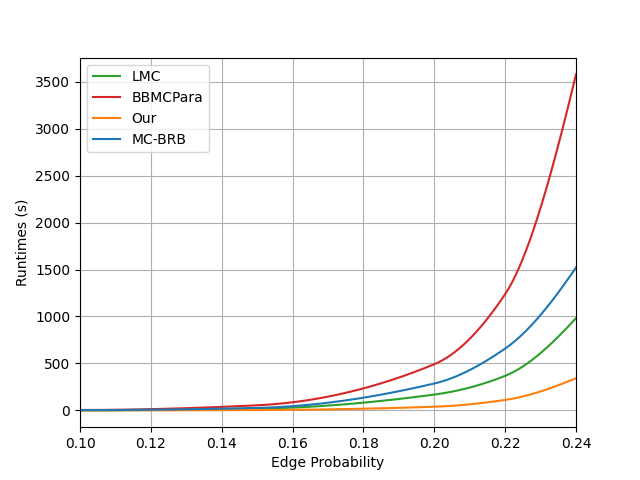

# Experiments

The tool has been tested aganist BBMCSP, LMC and MC-BRB three state-of-the art maximum clique solvers. Since they are not vailable in their parallel version, they has been first parallelised (over the first level subtree) trying to reproduce their original version as accurately as possible, so they could not match the performance of the original ones.
Correctness has been ensured by looking at the result of the real world networks.
The experiment machine has Intel Core i9-10900KF (10 physical cores, 20 logical) 64 GBs RAM and RTX 3070 8 GBs VRAM.

## Random Instances

All algorithms has been evalueated over random generated instances, unfortunately the artifact does not always ouperforms the selected state-of-the-art solvers

### Block-wise Parallelism

the random isntances have respectively 250, 1,000, 3,000, 10,000 and 100,000 vertices.
|Random 250 Vertices |
|-|
||

Denser instances requires a more advanced pruning strategy (MaxSAT Reasoning or the 
reduce technique).
But for locally sparse instances we have:

|Random 1,000 Vertices |Random 3,000 Vertices |
|-|-|
|  |  |

|Random 10,000 Veritces | Random 100,000 Vertices |
|-|-|
| |  |

### Warp-wise Parallelism

The Warp-wise parallel version, have been tested over the same instances, against the block-wise parallel version outperforming it in same cases thanks to a better SM occupancy

|Random 250 Veritces |
|-|
||

|Random 1,000 Vertices |Random 3,000 Vertices |
|-|-|
|  |  |

|Random 10,000 Veritces | Random 100,000 Vertices |
|-|-|
| |  |

## Real-world Instances

We selected our wold instances in order to cover as much as possible all the condition and graph topologies

| Instance | $\|V\|$ | $\|E\|$ | Density | Max. degree | Avg. degree | $\|\omega(G)\|$ |
|----------|----------|-------|---------|-------------|------------|-----------------|
| co-papers-dblp | 540,486 | 15,245,730 | 0.000104 | 3,299 | 56 | 337 |
| web-uk-2002-all | 18,520,486 | 298,113,763 | 2e-06 | 194,956 | 32 | 944 |
| c-62ghs | 41,731 | 300,538 | 0.000345 | 5,061 | 14 | 2 | 
| web-it-2004 | 509,338 | 7,178,414 | 5.5e-05 | 469 | 28 | 432 | 
| aff-orkut-user2groups | 8,730,857 | 327,037,488 | 9e-06 | 318,268 | 75 | 6 | 
| rec-yahoo-songs | 136,737 | 49,770,696 | 0.005324 | 31,431 | 728 | 19 | 
| soc-livejournal-user-groups | 7,489,073 | 112,307,386 | 4e-06 | 1,053,749 | 30 | 9 | 
| socfb-konect | 59,216,214 | 92,522,018 | 0 | 4,960 | 3 | 6 | 
| aff-digg | 872,622 | 22,624,728 | 5.9e-05 | 75,715 | 52 | 32 | 
| soc-orkut | 2,997,166 | 106,349,210 | 2.4e-05 | 27,466 | 71 | 47 | 
| soc-sinaweibo | 58,655,849 | 261,321,072 | 0 | 278,491 | 9 | 44 | 
| wiki-talk | 2,394,385 | 5,021,411 | 2e-06 | 100,032 | 4 | 26 | 
| bn-human-Jung2015_M87113878 | 1,772,034 | 76,500,873 | 4.9e-05 | 6,899 | 86 | 227 | 
| bn-human-BNU_1_0025864_session_2-bg | 1,827,241 | 133,727,517 | 8e-05 | 8,444 | 146 | 271 | 
| soc-flickr | 513,969 | 3,190,453 | 2.4e-05 | 4,369 | 12 | 58 | 
| tech-p2p | 5,792,297 | 147,830,699 | 9e-06 | 675,080 | 51 | 178 | 
| bn-human-BNU_1_0025864_session_1-bg | 1,827,218 | 143,158,340 | 8.6e-05 | 15,114 | 157 | 294 | 
| soc-flickr-und | 1,715,255 | 15,555,043 | 1.1e-05 | 27,236 | 18 | 98 | 
| socfb-A-anon | 3,097,165 | 23,667,395 | 5e-06 | 4,915 | 15 | 25 | 
| bn-human-Jung2015_M87126525 | 1,827,241 | 146,109,301 | 8.8e-05 | 8,009 | 160 | 220 | 
| bio-human-gene1 | 22,283 | 12,345,964 | 0.049731 | 7,940 | 1,108 | 1,335 | 
| bio-human-gene2 | 14,340 | 9,041,365 | 0.087942 | 7,230 | 1,261 | 1,300 | 
| soc-LiveJournal1 | 4,847,571 | 68,475,392 | 6e-06 | 22,887 | 28 | 321 | 
| web-wikipedia_link_it | 2,936,413 | 104,673,034 | 2.4e-05 | 840,650 | 71 | 870 | 
| web-indochina-2004-all | 7,414,866 | 194,109,312 | 7e-06 | 256,425 | 52 | 6,848 | 

The following data shows the scalability of the compared algorithm. Times are expressed in seconds, O.O.M. stays for Out Of Memory, and T.O. for Timeout Expired. Timeout has been set to 3,600 seconds.

### BBMCSP

The following are the runtimes of the parallelised BBMCSP. 

Instance|Single Thread Search|Single Thread Speed-up|2 Threads Search|2 Threads Speed-up|4 Threads Search|4 Threads Speed-up|8 Threads Search|8 Threads Speed-up|10 Threads Search|10 Threads Speed-up|20 Threads Search|20 Threads Speed-up|
|-------|--------------------|----------------------|----------------|---------------|---------------|-----------------|----------------|----------------|-----------------|-------------------|---------------|--------------------------|
aff-digg|498.929|1.0|305.82|1.631|161.96|3.081|90.602|5.507|78.632|6.345|55.898|8.926|
aff-orkut-user2groups|959.511|1.0|515.918|1.86|320.924|2.99|306.986|3.126|285.404|3.362|O.O.M|-|
bio-human-gene1|T.O.|-|T.O.|-|T.O.|-|T.O.|-|T.O.|-|T.O.|-|
bio-human-gene2|T.O.|-|T.O.|-|1767.08|-|795.261|-|510.788|-|289.05|-|
bn-human-BNU_1_0025864_session_1-bg|T.O.|-|T.O.|-|T.O.|-|T.O.|-|T.O.|-|T.O.|-|
bn-human-BNU_1_0025864_session_2-bg|359.28|1.0|202.085|1.778|100.395|3.579|54.288|6.618|47.667|7.537|38.278|9.386|
bn-human-Jung2015_M87113878|27.328|1.0|13.899|1.966|7.346|3.72|4.055|6.739|3.412|8.01|2.498|10.939|
bn-human-Jung2015_M87126525|865.677|1.0|503.263|1.72|319.573|2.709|178.843|4.84|158.499|5.462|128.318|6.746|
c-62ghs|0.012|1.0|0.008|1.495|0.005|2.326|0.004|3.098|0.004|2.908|0.025|0.493|
co-papers-dblp|-|-|-|-|-|-|-|-|-|-|-|-|
rec-yahoo-songs|728.392|1.0|375.84|1.938|194.15|3.752|104.557|6.966|92.986|7.833|81.467|8.941|
soc-LiveJournal1|0.01|1.0|0.014|0.727|0.016|0.607|0.015|0.642|0.014|0.703|0.011|0.906|
soc-flickr|2.057|1.0|1.398|1.472|0.763|2.696|0.511|4.026|0.419|4.908|0.225|9.155|
soc-flickr-und|58.753|1.0|41.184|1.427|25.488|2.305|17.127|3.43|13.52|4.346|9.575|6.136|
soc-livejournal-user-groups|496.203|1.0|257.73|1.925|161.903|3.065|129.463|3.833|123.021|4.033|120.697|4.111|
soc-orkut|37.044|1.0|18.613|1.99|9.838|3.765|5.685|6.516|4.915|7.537|3.461|10.702|
soc-sinaweibo|71.936|1.0|37.079|1.94|20.31|3.542|13.296|5.41|11.946|6.022|10.617|6.776|
socfb-A-anon|6.597|1.0|3.352|1.968|1.811|3.643|1.029|6.409|0.856|7.709|0.587|11.23|
socfb-konect|0.642|1.0|0.338|1.902|0.18|3.571|0.101|6.35|0.093|6.945|0.09|7.134|
tech-p2p|T.O.|-|T.O.|-|T.O.|-|T.O.|-|T.O.|-|T.O.|-|
web-indochina-2004-all|0.136|1.0|0.079|1.725|0.037|3.641|0.021|6.602|0.017|8.142|0.014|9.838|
web-it-2004|-|-|-|-|-|-|-|-|-|-|-|-|
web-uk-2002-all|-|-|-|-|-|-|-|-|-|-|-|-|
web-wikipedia_link_it|0.021|1.0|0.021|1.003|0.022|0.99|0.021|1.017|0.023|0.934|0.024|0.902|
wiki-talk|0.355|1.0|0.196|1.814|0.108|3.302|0.058|6.108|0.048|7.438|0.032|11.135|

### LMC

The following are the runtimes of our parallelised LMC expressed in seconds.

Instance|Single Thread Search|Single Thread Speed-up|2 Threads Search|2 Threads Speed-up|4 Threads Search|4 Threads Speed-up|8 Threads Search|8 Threads Speed-up|10 Threads Search|10 Threads Speed-up|20 Threads Search|20 Threads Speed-up|
|-------|--------------------|----------------------|----------------|---------------|---------------|-----------------|----------------|----------------|-----------------|-------------------|---------------|--------------------------|
aff-digg|95.55|1.0|51.93|1.84|31.75|3.009|25.1|3.807|23.24|4.111|13.71|6.969|
aff-orkut-user2groups|127.98|1.0|65.52|1.953|36.12|3.543|24.05|5.321|22.45|5.701|21.25|6.023|
bio-human-gene1|99.67|1.0|62.4|1.597|46.44|2.146|46.26|2.155|56.53|1.763|169.23|0.589|
bio-human-gene2|52.07|1.0|37.02|1.407|28.47|1.829|19.0|2.741|17.05|3.054|27.21|1.914|
bn-human-BNU_1_0025864_session_1-bg|306.85|1.0|159.33|1.926|82.31|3.728|43.81|7.004|37.53|8.176|31.52|9.735|
bn-human-BNU_1_0025864_session_2-bg|266.27|1.0|131.97|2.018|69.07|3.855|35.82|7.434|30.21|8.814|24.36|10.931|
bn-human-Jung2015_M87113878|141.14|1.0|71.86|1.964|39.36|3.586|22.47|6.281|19.24|7.336|16.89|8.356|
bn-human-Jung2015_M87126525|143.64|1.0|72.51|1.981|37.21|3.86|19.16|7.497|15.86|9.057|12.87|11.161|
c-62ghs|0.01|1.0|0.01|1.0|0.01|1.0|0.01|1.0|0.01|1.0|0.01|1.0|
co-papers-dblp|-|-|-|-|-|-|-|-|-|-|-|-|
rec-yahoo-songs|60.02|1.0|30.53|1.966|15.81|3.796|8.82|6.805|7.66|7.836|6.44|9.32|
soc-LiveJournal1|0.05|1.0|0.03|1.667|0.01|5.0|0.01|5.0|0.01|5.0|0.01|5.0|
soc-flickr|1.14|1.0|0.59|1.932|0.31|3.677|0.16|7.125|0.13|8.769|0.09|12.667|
soc-flickr-und|12.77|1.0|6.82|1.872|3.69|3.461|2.1|6.081|1.69|7.556|1.3|9.823|
soc-livejournal-user-groups|17.11|1.0|8.86|1.931|4.88|3.506|2.89|5.92|2.57|6.658|2.37|7.219|
soc-orkut|12.93|1.0|7.08|1.826|3.75|3.448|2.19|5.904|1.89|6.841|1.68|7.696|
soc-sinaweibo|10.43|1.0|7.73|1.349|4.11|2.538|2.4|4.346|2.58|4.043|2.5|4.172|
socfb-A-anon|2.0|1.0|1.05|1.905|0.55|3.636|0.33|6.061|0.28|7.143|0.24|8.333|
socfb-konect|0.09|1.0|0.1|0.9|0.1|0.9|0.12|0.75|0.12|0.75|0.12|0.75|
tech-p2p|98.14|1.0|53.32|1.841|26.68|3.678|16.18|6.066|14.5|6.768|12.8|7.667|
web-indochina-2004-all|36.88|1.0|17.66|2.088|9.8|3.763|5.84|6.315|4.91|7.511|4.57|8.07|
web-it-2004|-|-|-|-|-|-|-|-|-|-|-|-|
web-uk-2002-all|-|-|-|-|-|-|-|-|-|-|-|-|
web-wikipedia_link_it|0.16|1.0|0.09|1.778|0.05|3.2|0.02|8.0|0.02|8.0|0.02|8.0|
wiki-talk|0.23|1.0|0.12|1.917|0.06|3.833|0.03|7.667|0.03|7.667|0.02|11.5|

### MC-BRB

The following are runtimes expressed in seconds. Pay attention that 20 Threads Runtimes uses hyper-threading.

Instance|Single Thread Init.|Single Thread Search|Single Thread Init. S.U.|Single Thread Search S.U.|2 Threads Init.|2 Threads Search|2 Threads Init. S.U.|2 Threads Search S.U.|4 Threads Init.|4 Threads Search|4 Threads Init. S.U.|4 Threads Search S.U.|8 Threads Init.|8 Threads Search|8 Threads Init. S.U.|8 Threads Search S.U.|10 Threads Init.|10 Threads Search|10 Threads Init. S.U.|10 Threads Search S.U.|20 Threads Init.|20 Threads Search|20 Threads Init. S.U.|20 Threads Search S.U.|
|-------|---------|-----------|----------|-----------|---------|-----------|-----------|-----------|---------|-----------|-----------|-----------|---------|-----------|-----------|-----------|---------|-----------|-----------|-----------|---------|-----------|-----------|-----------|
aff-digg|35.051|539.181|1.0|1.0|17.938|266.951|1.954|2.02|9.856|138.247|3.556|3.9|5.668|69.992|6.184|7.704|4.777|60.192|7.338|8.958|3.954|43.518|8.864|12.39|
aff-orkut-user2groups|280.512|0.169|1.0|1.0|172.695|0.173|1.624|0.979|107.774|0.294|2.603|0.576|83.889|0.475|3.344|0.357|82.875|0.618|3.385|0.274|99.628|0.64|2.816|0.265|
bio-human-gene1|28.37|12.695|1.0|1.0|14.92|6.484|1.901|1.958|8.035|3.278|3.531|3.872|4.901|1.776|5.788|7.149|4.478|1.443|6.336|8.797|4.242|1.377|6.688|9.22|
bio-human-gene2|16.081|7.147|1.0|1.0|8.666|3.64|1.856|1.964|4.874|1.827|3.299|3.911|3.099|0.984|5.189|7.264|2.877|0.846|5.589|8.446|2.802|0.801|5.74|8.924|
bn-human-BNU_1_0025864_session_1-bg|214.506|35.35|1.0|1.0|111.58|17.735|1.922|1.993|59.721|9.009|3.592|3.924|33.318|4.569|6.438|7.736|29.126|3.829|7.365|9.232|23.367|3.102|9.18|11.394|
bn-human-BNU_1_0025864_session_2-bg|193.042|1.793|1.0|1.0|94.094|0.856|2.052|2.095|50.095|0.437|3.853|4.1|27.786|0.225|6.947|7.981|24.054|0.201|8.025|8.912|19.834|0.189|9.733|9.493|
bn-human-Jung2015_M87113878|58.166|0.022|1.0|1.0|30.568|0.014|1.903|1.619|16.843|0.011|3.453|2.046|9.844|0.011|5.909|1.956|8.449|0.024|6.884|0.945|7.257|0.039|8.015|0.577|
bn-human-Jung2015_M87126525|46.963|0.468|1.0|1.0|25.373|0.237|1.851|1.973|14.718|0.135|3.191|3.461|9.083|0.085|5.171|5.536|8.255|0.075|5.689|6.253|6.919|0.091|6.788|5.119|
c-62ghs|0.003|-|1.0|-|0.003|-|0.998|-|0.004|-|0.979|-|0.004|-|0.964|-|0.004|-|0.97|-|0.004|-|0.965|-|
co-papers-dblp|0.01|-|1.0|-|0.011|-|0.953|-|0.01|-|0.997|-|0.01|-|1.009|-|0.01|-|0.999|-|0.011|-|0.968|-|
rec-yahoo-songs|86.328|78.937|1.0|1.0|45.151|39.74|1.912|1.986|25.042|20.429|3.447|3.864|15.443|10.462|5.59|7.545|13.598|8.601|6.349|9.177|12.299|6.868|7.019|11.494|
soc-LiveJournal1|1.204|-|1.0|-|1.116|-|1.079|-|1.048|-|1.149|-|1.072|-|1.123|-|1.187|-|1.014|-|1.057|-|1.139|-|
soc-flickr|1.261|1.487|1.0|1.0|0.702|0.754|1.795|1.972|0.407|0.381|3.1|3.908|0.263|0.194|4.788|7.665|0.229|0.155|5.495|9.568|0.201|0.113|6.284|13.122|
soc-flickr-und|10.715|17.529|1.0|1.0|5.768|9.039|1.858|1.939|3.308|4.584|3.239|3.824|2.02|2.318|5.304|7.563|1.764|1.873|6.075|9.36|1.505|1.435|7.118|12.214|
soc-livejournal-user-groups|38.304|0.027|1.0|1.0|23.876|0.072|1.604|0.377|17.196|0.164|2.227|0.165|13.8|0.282|2.776|0.096|13.687|0.36|2.798|0.075|13.961|0.468|2.744|0.058|
soc-orkut|18.393|0.022|1.0|1.0|12.894|0.057|1.427|0.393|11.031|0.138|1.667|0.162|10.31|0.268|1.784|0.084|9.573|0.33|1.921|0.068|9.333|0.408|1.971|0.055|
soc-sinaweibo|24.541|0.09|1.0|1.0|23.212|0.198|1.057|0.454|22.363|0.48|1.097|0.187|21.836|0.717|1.124|0.125|21.277|0.464|1.153|0.194|21.526|1.604|1.14|0.056|
socfb-A-anon|1.565|0.004|1.0|1.0|1.337|0.011|1.17|0.324|1.29|0.022|1.213|0.168|1.218|0.042|1.285|0.086|1.259|0.055|1.243|0.066|1.282|0.083|1.221|0.044|
socfb-konect|4.809|-|1.0|-|4.786|-|1.005|-|4.698|-|1.024|-|4.828|-|0.996|-|4.854|-|0.991|-|4.902|-|0.981|-|
tech-p2p|78.166|98.971|1.0|1.0|45.151|49.892|1.731|1.984|28.05|25.406|2.787|3.895|20.877|13.019|3.744|7.602|18.743|10.644|4.17|9.298|17.682|9.411|4.421|10.516|
web-indochina-2004-all|0.49|-|1.0|-|0.505|-|0.971|-|0.507|-|0.966|-|0.502|-|0.977|-|0.511|-|0.96|-|0.501|-|0.978|-|
web-it-2004|0.005|-|1.0|-|0.005|-|1.011|-|0.005|-|1.024|-|0.005|-|0.994|-|0.005|-|0.982|-|0.005|-|1.024|-|
web-uk-2002-all|1.166|-|1.0|-|1.15|-|1.014|-|1.183|-|0.986|-|1.187|-|0.983|-|1.168|-|0.998|-|1.182|-|0.986|-|
web-wikipedia_link_it|3.15|-|1.0|-|3.192|-|0.987|-|3.154|-|0.999|-|3.205|-|0.983|-|3.131|-|1.006|-|3.308|-|0.952|-|
wiki-talk|0.441|0.086|1.0|1.0|0.315|0.043|1.399|1.981|0.242|0.023|1.825|3.697|0.217|0.013|2.035|6.853|0.203|0.01|2.175|8.607|0.191|0.009|2.307|10.022|

### MCP on GPU

The following are runtimes of real-world instances, it compare the Block-wise parallel vesion with Warp-wise one. Runtimes are expressed in seconds.

Instance|$\|\omega_0(G)\|$ (Block)|Init. (Block)|Search (Block)|$\|\omega_0(G)\|$ (Warp) |Init. (Warp)|Search (Warp)|
|-------|-----------|-------------|--------------|-----------|-----------|------------|
aff-digg|28|0.782|12.376|29|0.782|6.031|
aff-orkut-user2groups|2|18.336|1.794|2|16.116|1.671|
bio-human-gene1|1,328|0.478|587.406|1,328|0.482|243.54|
bio-human-gene2|1,293|0.44|43.427|1,293|0.434|52.116|
bn-human-BNU_1_0025864_session_1-bg|222|2.486|27.113|221|2.485|28.407|
bn-human-BNU_1_0025864_session_2-bg|198|2.669|11.605|197|2.694|14.706|
bn-human-Jung2015_M87113878|137|1.46|66.693|137|1.458|70.339|
bn-human-Jung2015_M87126525|196|2.176|4.902|196|2.17|4.68|
c-62ghs|2|0.059|0.002|2|0.058|0.02|
co-papers-dblp|337|0.067|-|337|0.067|-|
rec-yahoo-songs|16|1.672|3.091|16|1.658|3.996|
soc-LiveJournal1|320|0.334|0.1|320|0.372|0.105|
soc-flickr|52|0.184|0.054|54|0.184|0.048|
soc-flickr-und|74|0.483|1.128|72|0.485|0.719|
soc-livejournal-user-groups|5|11.685|0.258|5|11.759|0.251|
soc-orkut|17|3.419|0.239|18|3.374|0.23|
soc-sinaweibo|8|6.303|0.247|8|6.299|0.23|
socfb-A-anon|23|0.49|0.041|23|0.495|0.042|
socfb-konect|5|1.249|0.014|5|1.254|0.014|
tech-p2p|172|2.135|831.77|172|2.13|455.998|
web-indochina-2004-all|6,848|1.081|O.O.M.|6,848|1.085|O.O.M.|
web-it-2004|432|0.042|-|432|0.042|-|
web-uk-2002-all|944|15.281|-|944|0.65|-|
web-wikipedia_link_it|869|1.251|0.969|869|1.249|0.954|
wiki-talk|25|0.232|0.015|23|0.228|0.02|